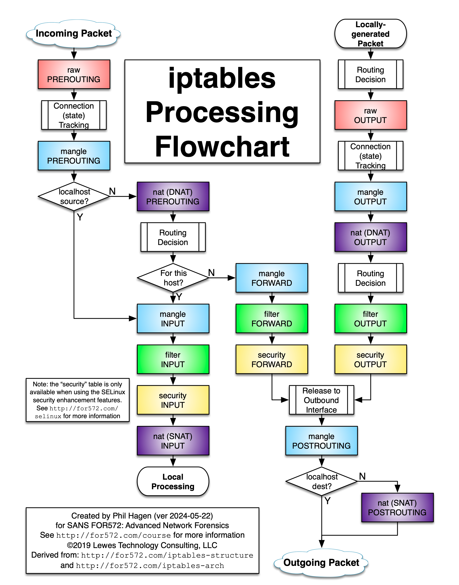

# Allow few IP Address to connect to docker

<figure><figcaption></figcaption></figure>


#### Ví dụ về việc sử dụng iptables chặn kết nối vào port nat trên Docker

Allow only ip 8.8.8.8 and 4.4.4.4 connect to port 3306

```
iptables -A DOCKER-USER -i eth0 -s 8.8.8.8 -p tcp -m conntrack --ctorigdstport 3306 --ctdir ORIGINAL -j ACCEPT
iptables -A DOCKER-USER -i eth0 -s 4.4.4.4 -p tcp -m conntrack --ctorigdstport 3306 --ctdir ORIGINAL -j ACCEPT
iptables -A DOCKER-USER -i eth0 -p tcp -m conntrack --ctorigdstport 3306 --ctdir ORIGINAL -j DROP
```

***

#### Lệnh 1:

```bash
iptables -A DOCKER-USER -i eth0 -s 8.8.8.8 -p tcp -m conntrack --ctorigdstport 3306 --ctdir ORIGINAL -j ACCEPT
```

**Giải thích:**

* **`-A DOCKER-USER`**: Thêm một quy tắc mới vào chuỗi `DOCKER-USER`. Chuỗi `DOCKER-USER` là một chuỗi do người dùng định nghĩa trong iptables, được Docker sử dụng để cho phép lọc lưu lượng mạng tùy chỉnh trước khi gói tin đến các chuỗi do Docker quản lý (như `DOCKER` hoặc `FORWARD`).
* **`-i eth0`**: Chỉ định giao diện mạng đầu vào là `eth0`. Quy tắc này áp dụng cho các gói tin đi vào hệ thống qua giao diện mạng `eth0` (thường là giao diện Ethernet).
* **`-s 8.8.8.8`**: Chỉ áp dụng cho các gói tin đến từ địa chỉ IP nguồn `8.8.8.8` (đây là địa chỉ DNS công cộng của Google, được sử dụng làm ví dụ).
* **`-p tcp`**: Chỉ áp dụng cho các gói tin sử dụng giao thức TCP.
* **`-m conntrack`**: Sử dụng mô-đun `conntrack` để kiểm tra trạng thái theo dõi kết nối. Mô-đun này giúp iptables hiểu được trạng thái và ngữ cảnh của các kết nối mạng.
* **`--ctorigdstport 3306`**: Khớp với các gói tin có **cổng đích ban đầu** (trước khi bị NAT chuyển đổi, ví dụ: ánh xạ cổng của Docker) là 3306. Cổng 3306 thường được sử dụng cho MySQL hoặc MariaDB.
* **`--ctdir ORIGINAL`**: Chỉ áp dụng cho các gói tin trong **hướng ban đầu** của kết nối (tức là từ máy khách đến máy chủ, khởi tạo kết nối). Điều này đảm bảo quy tắc chỉ áp dụng cho các yêu cầu kết nối mới, không áp dụng cho các gói tin trả lời.
* **`-j ACCEPT`**: Nếu gói tin thỏa mãn tất cả các điều kiện trên, nó sẽ được chấp nhận (cho phép đi tiếp đến đích, ví dụ: một container Docker chạy MySQL trên cổng 3306).

**Tóm tắt:**

Quy tắc này cho phép lưu lượng TCP từ địa chỉ IP `8.8.8.8` qua giao diện `eth0` truy cập vào dịch vụ (có thể là MySQL/MariaDB) trên cổng 3306 trong một container Docker.

***

#### Lệnh 2:

```bash
iptables -A DOCKER-USER -i eth0 -s 4.4.4.4 -p tcp -m conntrack --ctorigdstport 3306 --ctdir ORIGINAL -j ACCEPT
```

**Giải thích:**

Quy tắc này gần giống với quy tắc thứ nhất, chỉ khác ở địa chỉ IP nguồn:

* **`-s 4.4.4.4`**: Chỉ áp dụng cho các gói tin đến từ địa chỉ IP nguồn `4.4.4.4` (một địa chỉ IP ví dụ, thường liên quan đến DNS công cộng của Level 3).

Các thành phần khác (`-i eth0`, `-p tcp`, `-m conntrack`, `--ctorigdstport 3306`, `--ctdir ORIGINAL`, `-j ACCEPT`) đều giống quy tắc đầu tiên.

**Tóm tắt:**

Quy tắc này cho phép lưu lượng TCP từ địa chỉ IP `4.4.4.4` qua giao diện `eth0` truy cập vào dịch vụ trên cổng 3306 trong container Docker.

***

#### Lệnh 3:

```bash
iptables -A DOCKER-USER -i eth0 -p tcp -m conntrack --ctorigdstport 3306 --ctdir ORIGINAL -j DROP
```

**Giải thích:**

* **`-A DOCKER-USER`**: Thêm một quy tắc mới vào chuỗi `DOCKER-USER`.
* **`-i eth0`**: Áp dụng cho các gói tin đi vào qua giao diện `eth0`.
* **`-p tcp`**: Chỉ áp dụng cho các gói tin sử dụng giao thức TCP.
* **`-m conntrack`**: Sử dụng mô-đun `conntrack` để theo dõi kết nối.
* **`--ctorigdstport 3306`**: Khớp với các gói tin có cổng đích ban đầu là 3306.
* **`--ctdir ORIGINAL`**: Chỉ áp dụng cho các gói tin trong hướng ban đầu (từ máy前期

System: máy khách đến máy chủ).

* **`-j DROP`**: Loại bỏ (chặn) các gói tin khớp với quy tắc, ngăn không cho chúng đến đích.

**Tóm tắt:**

Quy tắc này chặn tất cả lưu lượng TCP đến cổng 3306 trên giao diện `eth0`, trừ những gói tin đã được phép bởi các quy tắc trước đó trong chuỗi `DOCKER-USER`.

***

#### Tác động tổng thể của các quy tắc:

Ba quy tắc này tạo thành một **danh sách trắng** (whitelist) cho việc truy cập cổng 3306:

1. Quy tắc thứ nhất cho phép lưu lượng từ `8.8.8.8` đến cổng 3306.
2. Quy tắc thứ hai cho phép lưu lượng từ `4.4.4.4` đến cổng 3306.
3. Quy tắc thứ ba chặn tất cả các lưu lượng TCP khác đến cổng 3306 trên giao diện `eth0`.

**Cách iptables xử lý quy tắc:**

* iptables đánh giá các quy tắc theo thứ tự chúng được định nghĩa trong chuỗi.
* Khi một gói tin khớp với một quy tắc, hành động tương ứng (ví dụ: `ACCEPT` hoặc `DROP`) sẽ được thực hiện, và các quy tắc tiếp theo trong chuỗi không được đánh giá nữa.
* Trong trường hợp này:
  * Các gói tin từ `8.8.8.8` hoặc `4.4.4.4` đến cổng 3306 được phép đi qua (quy tắc 1 và 2).
  * Tất cả các gói tin khác đến cổng 3306 trên `eth0` sẽ bị chặn (quy tắc 3).

**Tại sao sử dụng `DOCKER-USER`?**

* Chuỗi `DOCKER-USER` được thiết kế để người dùng thêm các quy tắc lọc tùy chỉnh, được đánh giá **trước** các quy tắc NAT và chuyển tiếp của Docker. Điều này cho phép quản trị viên áp dụng các chính sách lọc mà không bị Docker ghi đè khi khởi động lại hoặc cập nhật container.
* Các quy tắc này rất hữu ích khi bạn muốn giới hạn quyền truy cập vào một dịch vụ trong container (như cơ sở dữ liệu MySQL) chỉ cho một số địa chỉ IP cụ thể.

**Tại sao sử dụng `--ctorigdstport` và `--ctdir ORIGINAL`?**

* **`--ctorigdstport`**: Docker thường sử dụng NAT để ánh xạ cổng bên ngoài với cổng trong container. Ví dụ, cổng 3306 bên ngoài có thể được ánh xạ tới cổng 3306 trong container. Tùy chọn `--ctorigdstport` đảm bảo quy tắc khớp với **cổng đích ban đầu** trước khi NAT chuyển đổi, rất quan trọng trong môi trường Docker.
* **`--ctdir ORIGINAL`**: Đảm bảo quy tắc chỉ áp dụng cho các yêu cầu kết nối mới (từ máy khách đến máy chủ), không áp dụng cho các gói tin trả lời, tránh làm gián đoạn các kết nối đã thiết lập.

***

#### Ví dụ thực tế:

Giả sử bạn có một container Docker chạy MySQL, được ánh xạ trên cổng 3306, và bạn muốn giới hạn quyền truy cập chỉ cho hai địa chỉ IP đáng tin cậy (`8.8.8.8` và `4.4.4.4`). Các quy tắc này sẽ:

* Cho phép `8.8.8.8` và `4.4.4.4` khởi tạo kết nối TCP đến cổng 3306 trên giao diện `eth0`.
* Chặn tất cả các địa chỉ IP khác cố gắng kết nối đến cổng 3306.

**Một số lưu ý:**

* Các quy tắc này giả định `eth0` là giao diện mạng chính nhận lưu lượng từ bên ngoài. Nếu hệ thống của bạn sử dụng giao diện khác (như `ens33`, `wlan0`), bạn cần điều chỉnh tham số `-i`.
* Các quy tắc này chỉ áp dụng cho lưu lượng TCP. Nếu cần kiểm soát các giao thức khác (như UDP), bạn cần thêm các quy tắc bổ sung.
* Quy tắc `DROP` đảm bảo chính sách từ chối mặc định cho cổng 3306, là một phương pháp bảo mật tốt cho các dịch vụ nhạy cảm như cơ sở dữ liệu.
* Nếu container Docker được khởi động lại hoặc các quy tắc iptables của Docker được tạo lại, chuỗi `DOCKER-USER` vẫn được giữ nguyên, đảm bảo các quy tắc này vẫn có hiệu lực.

***

#### Một số cải tiến hoặc lưu ý:

1.  **Ghi log các gói tin bị chặn**: Để theo dõi hoặc khắc phục sự cố, bạn có thể thêm một quy tắc ghi log trước quy tắc `DROP`:

    ```bash
    iptables -A DOCKER-USER -i eth0 -p tcp -m conntrack --ctorigdstport 3306 --ctdir ORIGINAL -j LOG --log-prefix "Dropped MySQL Access: "
    ```
2. **Dải địa chỉ IP**: Nếu cần cho phép một dải địa chỉ IP, bạn có thể sử dụng ký hiệu CIDR (ví dụ: `-s 192.168.1.0/24`) thay vì các địa chỉ IP riêng lẻ.
3.  **Theo dõi trạng thái**: Các quy tắc đã sử dụng `conntrack`, nhưng bạn có thể thêm quy tắc cho phép các kết nối đã thiết lập:

    ```bash
    iptables -A DOCKER-USER -i eth0 -p tcp -m conntrack --ctstate ESTABLISHED,RELATED -j ACCEPT
    ```

    Quy tắc này nên được thêm **trước** quy tắc `DROP` để tránh làm gián đoạn các kết nối hiện có.
4. **Lưu trữ quy tắc**: Các quy tắc iptables không được lưu tự động sau khi khởi động lại máy. Để lưu vĩnh viễn, sử dụng công cụ như `iptables-persistent` hoặc lưu/lấy lại các quy tắc bằng tay.

***

#### Kết luận:

Các quy tắc `iptables` này tạo ra một chính sách tường lửa:

* Cho phép lưu lượng TCP đến cổng 3306 (thường là MySQL) từ các địa chỉ IP `8.8.8.8` và `4.4.4.4` trên giao diện `eth0`.
* Chặn tất cả các lưu lượng TCP khác đến cổng 3306 trên `eth0`.
* Sử dụng chuỗi `DOCKER-USER` để tương thích với mạng Docker.
* Sử dụng mô-đun `conntrack` để khớp chính xác cổng đích ban đầu và hướng kết nối, đảm bảo kiểm soát chặt chẽ các kết nối đến.
